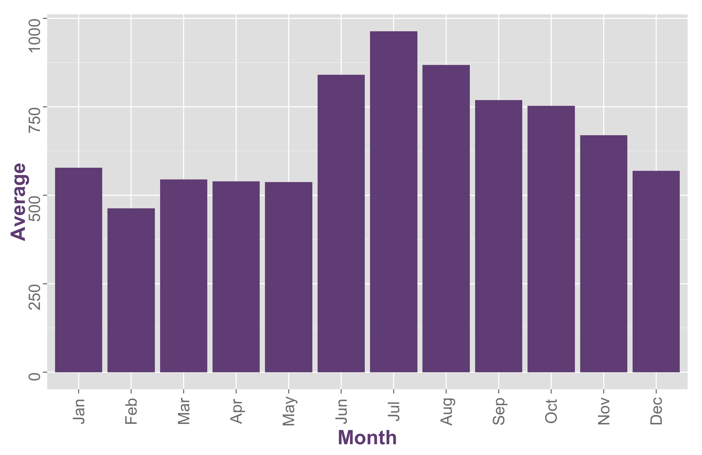
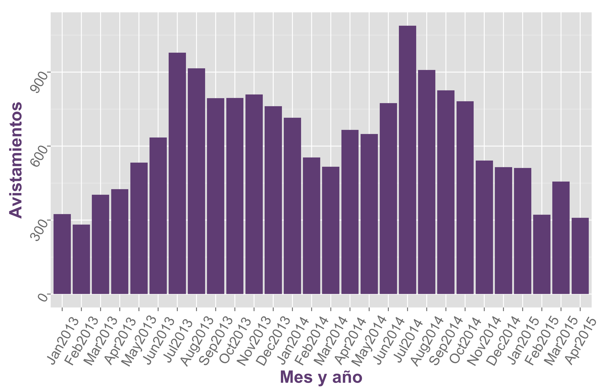

---
output: html_document
---

<link href="http://kevinburke.bitbucket.org/markdowncss/markdown.css" rel="stylesheet"></link>
<style>
h1 {
    color:#7D207D;
}
h2 {
    color:#C65896;
}
h3 {
    color:#9C748B;
}
h4{
    color:#9C748B;
}
h5{
  color:#9C748B;
}
div {
    text-align:justify;
    text-justify:inter-word;
}
hr{
    border-width:4px;
    color:#1A237E;
}
br{
    line-height:100%;
}
c{
  font-size:120%
}
ol.img li{background: img(src="robot.jpg") no-repeat scroll 1px 5px transparent;
    list-style-position: inside;
    padding-left: 16px;}

.hentry code {
  display: block;
  background: lightgrey;
  padding: 10px;
  overflow: auto;
}

blockquote{
color:##990099;
margin:0;
padding-left: 3em;
border-left: 0.5em #EEE solid;
}

pre, xmp, plaintext, listing {
    white-space: pre;
}
.markdown-body pre > code {
    white-space: pre;
}
.markdown-body code {
    white-space: nowrap;
}

r
{
    padding-right: 15px;
}
l
{
     padding-left:  145px;
}

</style>


# *Analisis de avistamientos de UFOs* <br> *en USA y eventos sociopoliticos* <br> *mundiales  usando Postgres*
##Proyecto 2 - Metodos de Gran Escala <br>
###5/junio/2015

<br>
<body>
 
</body>

<br>
<br>
<br>
<br>
<hr noshade="TRUE">

#### <l> Fernanda Mora              --             Luis Roman

<hr noshade="TRUE">
<br>

> *"Errors using inadequate data are much less than those using no data at all"*

##Contenido
<body>
 
</body>
<br>
<c> 1. Datos a analizar y configuracion de PostgreSQL  <br> 2. Analisis de datos: UFO  <br> 3. Analisis de datos: GDELT  <br> 4. Conclusiones <br>
</c >

## 1. Datos a analizar y configuracion <br>  de PostgreSQL

El objetivo de este proyecto fue  analizar dos bases de datos usando PostgreSQL:

**1.  Avistamientos de OVNIS en los Estados Unidos desde 1900 hasta la fecha**. Registro de variables como fecha, estado, forma, etc.  Provista por el *National UFO Reporting Center.*

**2.  Eventos sociopolíticos a nivel mundial**. Con variables como actores involucrados, geolocalización, importancia del evento, etc. Provista por el proyecto *Global Data on Events, Location and Tone (GDELT).*

Para llevar a cabo lo anterior primero se configuro una maquina en AWS para poder bajar los datos. Esta maquina tiene 4 GB de memoria RAM y ademas se le
añadio un SSD  de 100 GB para procesar la base de datos.

A dicha maquina se le instalo postgres como lo hicimos en los contenedores de clase. Adicionalmente se le instalo R para
la parte del modelo predictivo. Todo se trabajo en esta maquina a excepcion de las ultimas consultas para GDELT debido a que
las queries se tardaban mucho tiempo en correr (+1 hr), por lo que se uso la herramienta de Google *Big Query* que permitio
correr las consultas en pocos segundos.

En este documento no se incluyen todos los comandos ejecutados para la configuracion de PostgreSQL  y la carga de las bases (no fueron requeridos en el entregable), sin embargo se pueden proporcionar si son necesarios.


## 2. Analisis de datos: UFO

Primero abrimos PostgreSQL en la maquina virtual y echamos un vistazo a las variables existentes::

```{r, eval=FALSE}
psql -d bigdata
\d+ sightings
```
Ahora procedemos a responder las preguntas planteadas para este proyecto.

###  *¿Cual fue el primer avistamiento en cada estado?*
Vemos que casi todos los estados reportan haber tenido su primer avistamiento en 1900, a excepcion
de Florida, Nebraska, Kansas y California.

```{r, eval=FALSE}
    select MIN(date_time), state_str  from sightings group by state_str;
```

### *¿Cual fue el primer avistamiento de cada forma?*

```{r, eval=FALSE}
select MIN(date_time), shape from sightings group by shape;
```
```{r, eval=FALSE}
anio<-c(1900,1900,1974,1900,1979,1900,1996,1995,1997,1900,1997,1900,1997,1997,1985,1900,1997,1900)
forma<-c("Cylinder","Changing", "Delta", "Light", "Rectangle", "Cigar", "Dome", "Round", "unknown", "flash", "Fireball", "sphere", "Hexagon", "Oval", "Formation", "Flare", "Chevron")
```
Podemos observar que las formas mas geometricas son vistas mas tardiamente, como esferica y hexagonal, mientras que
formas menos definidas como ligera, cambiante, bola de fuego, formacion son vistas pro primera vez mucho antes.
De hecho, la primera vez que se  declara haber visto una forma "desconocida" es hasta 1997.

**1900:** Cilindro, Ligera, Cambiante, Cigar, Diamante, Bola de Fuego, Formacion, Chevron <br>
**1974:** Delta <br>
**1979:** Rectangulo <br>
**1985:** Oval <br>
**1995:** Redonda <br>
**1997:** Desconocida, esferica, hexagonal, flash, bengala <br>

### *¿Tiempo promedio entre avistamientos, por mes?*

```{r, eval=FALSE}
select month, avg(difference) from (select line_number, date_time, date_time - lag(date_time) over (order by date_time) as difference, date_part('month', date_time) as month from sightings) t group by month;
```
Vemos que el estado que en promedio tuvo mas tiempo entre avistamientos fue Enero, con casi 4 dias, mientras que agosto fue
el que tuvo menos tiempo entre avistamientos, con menos de 5 hrs. Esto es consistente con lo obtenido en el primero proyecto:
 Enero es de los meses con menos avistamientos y Agosto de los meses con mas avistamientos.

 Para estados con   pocos avistamientos como Febrero pero tambien poco tiempo promedio entre avistamientos lo que puede estar
 sucediendo es que estos estan concentrados en alguna parte del mes, es decir, que no se distribuyen uniformemente y esta
 sospecha se confirmo graficando los avistamientos de este mes.

**Enero**: 3 days 21:02:49.42 hrs <br>
**Febrero**: 10:33:06.55 hrs <br>
**Marzo**: 08:32:57.24 hrs <br>
**Abril**: 13:53:32.87 <br>
**Mayo**: 08:52:08.39 <br>
**Junio**: 14:06:30.43 <br>
**Julio**: 07:37:40.98 <br>
**Agosto**: 05:09:20.37 <br>
**Septiembre**: 06:55:31.95 <br>
**Octubre**: 07:54:19.49 <br>
**Noviembre**: 05:43:42.435 <br>
**Diciembre**: 15:24:25.63 <br>

En cuanto al numero promedio de avistamientos por mes tenemos  que julio es el que tiene mas
avistamientos y que casi llegan a 1,000:

<body>
 
</body>


### *¿Tiempo promedio entre avistamientos por año?*

Podemos observar que los datos se parten en dos conjuntos: a partir del año 1995 se tiene un tiempo promedio entre avistamientos menor a 6 horas.
Y de 1994 hacia atras se tiene de 1-2  dias entre avistamientos. La unica observacion atipica es el año 1900 y 1969 con 0 y  140 dias
respectivamente pero esto era de esperarse ya que se tenian muy pocas o nulas observaciones, de tal forma que el tiempo promedio entre
avistamientos es muy chico.

```{r, eval=FALSE}
select year, avg(difference) from (select line_number, date_time, date_time - lag(date_time) over (order by date_time) as difference, date_part('year', date_time) as year from sightings) t group by year order by year;
```
Por otro lado, el comportamiento promedio del numero de avistamientos de los ultimos dos años se ven asi:

<body>
 
</body>


### *¿Promedio entre avistamientos por estado?*
Vemos que los top5 estados con menor tiempo entre avistamientos son: California, Nebraska, New-Hampshire y Carolina del Sur con menos de 5 hrs entre avistamientos.
Los top 5 con mayor tiempo entre avistamientos son: North Dakota, Pensilvania, Alabama y Orlando.

Como hipotesis, podriamos decir que esperamos un menor tiempo promedio entre avistamientos para estados menos urbanizados y viceversa para estados
mas urbanizados. Si bien lo encontrado anterior es un proxy a esta informacion, posiblemente una manera de corroborar  la afirmacion es ponderando por la poblacion de cada estado, pues a pesar de que estados altamente alfabetizados  como Nueva York tienen un tiempo de 14 hrs, tambien es cierto que es un estado muy poblado, lo cual tendera a alzar este numero.

```{r, eval=FALSE}
select state_str, avg(difference) from (select line_number, date_time, date_time - lag(date_time) over (order by date_time) as difference,   state_str from sightings) t  group by state_str ;

```

### *¿Cuál es el estado con mayor varianza?*
California el de mayor varianza lo que significa que los avistamientos no estan distribuidos uniformemente a lo largo del tiempo. Pensilvania el de menor varianza.

```{r, eval=FALSE}
select state_str, variance(count) as variance from (select state_str, date_part('month', date_time) as month, date_part('year', date_time) as year, count(*) as count  from sightings group by state_str, month, year order by state_str, month, year) t group by state_str order by variance DESC;
```

### *¿Existen olas temporales?*
Si, y en todos los años, pues obtenemos que siempre hay rachas de al menos tamaño 2. Pero no sabemos que tan grandes son estas olas.

```{r, eval=FALSE}
select month, year, count(*) from (select line_number, date_time, year, month, extract(epoch from difference)/3600 as hour_diff from (select line_number, date_time, date_time - lag(date_time) over (order by date_time) as difference, date_part('year', date_time) as year, date_part('month', date_time) as month from sightings) t) t1 where 24< hour_diff and hour_diff <= 48 group by month, year order by year, month;
```
### *¿Existen olas espacio- temporales?*

Si, en algunos estados, pero mucho menos marcadas que las temporales exclusivamente.

```{r, eval=FALSE}
select state_str, month, year, count(*) as count from (select line_number, date_time, state_str, year, month, extract(epoch from difference)/3600 as hour_diff from (select line_number, state_str, date_time, date_time - lag(date_time) over (order by date_time) as difference, date_part('year', date_time) as year, date_part('month', date_time) as month from sightings) t) t1 where 24< hour_diff and hour_diff <= 48 group by state_str, month, year order by state_str, count DESC;
```

### *¿Relacionado con la geografia?*

No se encontro que este relacionado de manera notoria con la ciudad de procedencia por estado:

```{r, eval=FALSE}
select state_str, city_str, count(*) as count from sightings group by state_str, city_str order by state_str, city_str, count;
```

### *¿Narrativas parecidas?*

Para esto se uso el paquete de postgres para analizar similaridades:

```{r, eval=FALSE}
select date_time, city_str, state_str, similarity(summary, lag(summary) over (order by date_time, state_str)) as simil from sightings order by state_str, date_time;
```

###  Modelo predictivo para avistamientos:

El modelo predictivo se desarrollo usando R.

Como es usual, primero cargamos las librerias que vamos a utilizar:

```{r}
library(rmarkdown)
library(ggplot2)
library(RPostgreSQL)
```
Usamos el paquete *RPostgreSQL*  el cual  nos permitira conectar Postgres con R.

Para la conexion con Postgres usamos la siguiente instruccion:

```{r, eval = FALSE}
drv <- dbDriver("PostgreSQL")
```
Posteriormente hacemos conexion a las base de datos que hay en la maquina y guardamos la de *Avistamientos*:

```{r, eval = FALSE}
con <- dbConnect(drv, dbname="bigdata", user="postgres")
ufo<- dbReadTable(con,"sightings")
```
Y entonces ya podemos trabajar con *ufo* como si fuera un dataframe de R y llevar a cabo nuestro modelo de
prediccion. Primero vemos las columnas:

```{r}
ufo = read.csv("ufo_.csv")
colnames(ufo)
```

Serie de tiempo global:

```{r}
history <- plyr::count(ufo$Year)
plot.global <- ggplot(data = history, aes(x = x, y = freq )) +
       geom_line(alpha = .5, color = "darkmagenta") +
       geom_smooth(color = "springgreen1") +
       xlab("Año") +
       ylab("# de Avistamientos") +
       ggtitle("Historico de avistamientos en USA") +
       xlim(1900,2014)+
       theme(panel.background = element_blank())
plot.global
```
<br>

Hicimos un modelo de series de tiempo predictivo para el numero de avistamientos
anuales.

El ajuste nos da un modelo tipo ARIMA (1, 0, 12), i.e. p=1, d=0, q=12.


## 3. Analisis de datos: GDELT

Para la base de GDELT primero responderemos preguntas parecidas a las de UFO.

Posteriormente nos enfocaremos en el caso de Mexico y veremos si es posible generar clusters de paises con
respecto a alguna variable y en este caso ver a que paises se parece Mexico.

###  *¿Cuando  fue el primer evento  iniciado en cada pais?*

Aparece que el primer evento iniciado, en todos los  paises fue en 1979-1980  a exepcion de los siguientes paises:

1. "LAM": Este codigo no esta en los codigos del ISO 3166-1 alpha-3, pero se busco en el codigo de
 eventos de CAMEO version 2012 y se encontro que se refiere al la etnia del pais africano *Benin*, situado al oeste
 medio de Africa. Se reporta que el primerl evento fue en 1983. No se tomaran los codigos que aparezcan
 en esta consulta y que sean de CAMEO porque solo estamos considerando paises, no grupos etnicos.

 2. "NAF": no se encontro que pais corresponde a este codigo (ni en CAMEO ni el el ISO 3166) pero
 reporta su primer evento en 1998.

 3. "PRI": Puerto Rico, reporta su primer evento hasta 2006.

 4. "AND": Andorra, 1984.


```{r, eval=FALSE}
    select MIN(fractiondate), actor1countrycode  from gdelt group by actor1countrycode;
```


###  *¿Cuando  fue el primer evento  en contra de cada pais?*

De igual manera casi todos los paises tienen su primer avistamiento en 1979-1980 y llama la atencion
el caso de Puerto Rico, en donde el mismo evento reportado arriba se vuelve a mencionar como siendo el
pais afectado. O sea que este fue un evento de Puerto Rico contra Puerto Rico.

```{r, eval=FALSE}
    select MIN(fractiondate), actor2countrycode  from gdelt group by actor2countrycode;
```

Es importante mencionar que las siguientes queries ya no corrian en  el servidor que teniamos.

Buscamos mas opciones alternativas como aumentar la capacidad del servidor, lo cual iba a salir un tanto caro. Finalmente encontramos
la herramienta de Google "Bigquery" que ya tenia cargada la base de GDELT y corria las queries bastante rapido.

¡Que bueno hubiera sido haber encontrado este herramienta antes! Entonces a partir de este punto decidimos correrlas usando esta herramienta de Google :).

### *¿Cuando se dio el primer evento de cada tipo?* <br>
1=Verbal Cooperation, 2=Material Cooperation, 3=Verbal Conflict, <br>
4=Material Conflict y quien lo encabezo?*

```{r, eval=FALSE}
      select MIN(fractiondate), QuadClass from [gdelt-bq:full.events] group by QuadClass;
```


### *¿Cuando se dio el primer evento de cada tipo?* <br>
```{r, eval=FALSE}
      select MIN(fractiondate), QuadClass from [gdelt-bq:full.events] group by QuadClass;
```

Se uso la variable **Goldstein* scale que si aparece en la base y que como dicen en la
documentacion, estima el impacto potencial teoretico que un evento tiene en un pais determinado.
Se mide en una escala de -10 - +10:

### *¿Que paises han encabezado un  evento teoricamente  importante?* <br>

Corremos la query en *BigQuery* y guardamos el CSV generado para poderlo analizar en R:

```{r, eval=FALSE}
       SELECT MAX(goldsteinscale), actor1countrycode FROM [gdelt-bq:full.events] group by actor1countrycode;
```
Podemos ver que de los 225 paises contemplados, practicamente todos han reportado encabezar un evento con la maxima
escala de importancia, 10, es decir, todos reportan haber tenido un evento que ha marcado de manera importante
al pais:

```{r}
    goldstein = read.csv("goldstein_max.csv")
plot.goldstein<-qplot(as.factor(goldstein$f0_), geom="histogram")+
    geom_bar(binwidth = 1.5, fill="#B06A98")+
    labs(title = "Histograma del evento mas importante de todos los paises")+
    xlab("Puntaje de Goldstein del evento mas importante")+
    ylab("# de Paises")+
    theme(panel.background = element_blank())
plot.goldstein
```
<br>

Sin embargo, hay otra variable, **avgtone**, que nos dice que tan seria fue la ocurrencia de tal evento,
medida como el "tono medio" de los documentos que tienen menciones a este evento. Es decir, un
**avgtone** negativo nos dice que el evento fue serio dado el clima existente en ese momento y viceversa
para un **avgtone** positivo. Esta metrica, a diferencia de la escala de **Goldstein** nos va a dar una
medida de la importancia del evento en *el momento en el que ocurrio*. Va de -100 a +100.

Ambas metricas son interesantes y se complementan.

### *¿Que paises han encabezado un  evento  importante en su momento?* <br>

```{r, eval=FALSE}
    select MIN(avgtone), actor1countrycode from [gdelt-bq:full.events] group by actor1countrycode;
```

Vemos que la mayoria de los paises reportan un impacto de entre -25 y -10, siendo que el minimo
es de -100. Esto significa que aunque hay eventos que han tenido un impacto real en el pais, en su momento
no se reportaron con ese nivel de importancia, sino con una menor.


```{r}
avgtone_neg = read.csv("avg_neg.csv")
plot.avg_neg <- hist(avgtone_neg$f0_, breaks=10, col="#B06A98", xlab="Tono mediatico (negativo)", ylab="# Paises", main="Histograma del los eventos con mas impacto mediatico por pais")+
    theme(panel.background = element_blank())
plot.avg_neg
```

### *Eventos en Mexico*


#### *Conflictos en Mexico*

Primero obtenemos los *conflictos en Mexico* y los guardamos en un csv:

```{r, eval=FALSE}
SELECT MonthYear, actor1geo_long, actor1geo_lat, actor1geo_fullname,
        count(*) c_mx
FROM [gdelt-bq:full.events]
WHERE eventcode = '19' AND actor1geo_countrycode = 'MX'
GROUP BY monthyear, actor1geo_long, actor1geo_lat, actor1geo_fullname
ORDER BY monthyear;
```
<br>
<br>

Usando las coordendas de los conflictos que arrojo la consulta, Se hizo un mapa de calor usando *rCharts* y *rMaps*. El codigo de los mapas es extenso y por ese motivo se adjunta como anexo.

El mapa de conflictos es el siguiente y se puede ver que las zona mas conflictiva es la zona
inferior del pais.

<body>
 
</body>

Si visitamos el mapa interactivo para darle zoom podemos observar que los focos de conflicto han  sido la Ciudad de Mexico, Puebla, Leon, Oaxaca,
y varias zonas de guerrillas de Chiapas y Tabasco:

<p><a href="file:///home/sophie/ITAM/metodosGranEscala/proyectos/Proyecto%202/calor.html" title="Title">Mapa de conflictos  de Mexico interactivo</a> </p>

#### *Mexico vs el Mundo*

Para hacer una comparacion de Mexico vs el mundo, hacemos la siguiente consulta en *BigQuery*:


```{r, eval=FALSE}
SELECT Year, Actor1Name, Actor2Name, Count FROM (
    SELECT Actor1Name, Actor2Name, Year, COUNT(*) Count,
    RANK() OVER(PARTITION BY YEAR ORDER BY Count DESC) rank
    FROM
    (
        SELECT Actor1Name, Actor2Name,  Year
        FROM [gdelt-bq:full.events]
        WHERE Actor1Name < Actor2Name and Actor1CountryCode != '' and
        Actor2CountryCode != '' and Actor1CountryCode!=Actor2CountryCode
        and ActionGeo_CountryCode='MX'),
    (
        SELECT Actor2Name Actor1Name, Actor1Name Actor2Name, Year
        FROM [gdelt-bq:full.events]
        WHERE Actor1Name > Actor2Name  and Actor1CountryCode != ''
        and Actor2CountryCode != '' and Actor1CountryCode!= Actor2CountryCode
        and ActionGeo_CountryCode='MX'),
        WHERE Actor1Name IS NOT null
        AND Actor2Name IS NOT null
        GROUP EACH BY 1, 2, 3
        HAVING Count > 100
    )
    WHERE rank=1
    ORDER BY Year;
```
Esto nos arroja que todos los eventos iniciados por Mexico fueron contra Estados Unidos:

```{r}
mexvsmundo = read.csv("actoresmex.csv")
head(mexvsmundo)
```

Y los eventos anuales fueron los siguientes y vemos que desde 2005 el numero de eventos ha ido aumentando dramaticamente

```{r}
Eventos_vs_USA<- ts(mexvsmundo$Count,start=c(1980), end=c(2015), frequency=1)
plot(Eventos_vs_USA)
```

## 4. Conclusiones

Como conclusiones podemos señalar que la variedad de consultas que se pueden hacer para
la base de datos de GDELT es mucho mas rica que para la de avistamientos.

Este trabajo solo presenta las consultas mas basicas, hay un mar de posibilidades de Analitica sobre
todo para la base de GDELT y nos parece muy relevante que las autoridades gubernamentales tengan a la mano este
tipo de herramientas que, si son usadas adecuadamente, permitiran una mejor planeacion de politicas publicas.


### Nota: El proyecto fue desarrollado en pareja para mejorar el rendimiento y resultados del mismo, esperando no
### haya inconvenientes en ello

<hr noshade="TRUE">
