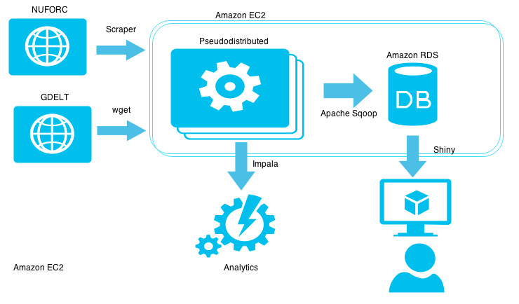
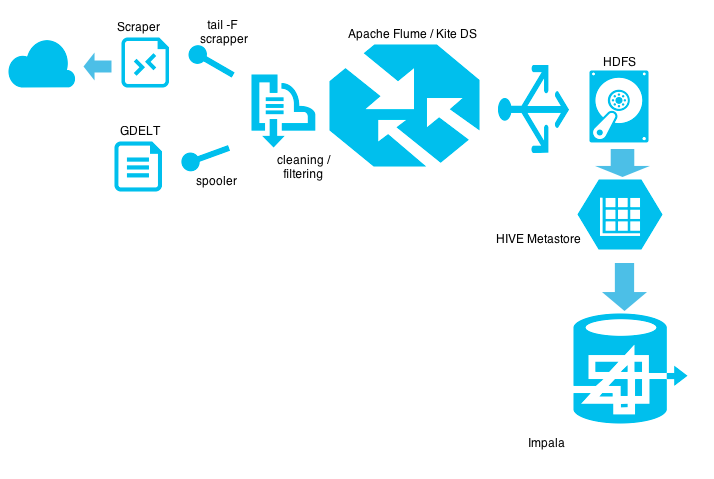
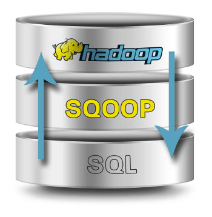
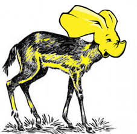
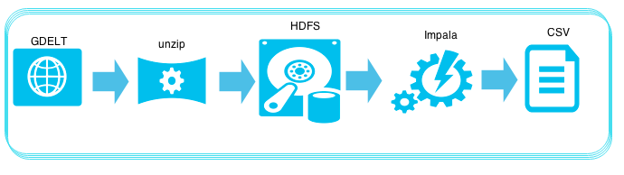

---
output: html_document
---

<link href="http://kevinburke.bitbucket.org/markdowncss/markdown.css" rel="stylesheet"></link>

# *Implementación de una arquitectura*   *de Big Data  usando distintos*    *frameworks y lenguajes*  
##Proyecto Final - Métodos de Gran Escala  
###5/junio/2015

 
<body>
 
</body>

 
 
 
 

#### <l> F. Mora -- <r> A. García -- <r> S. Haro -- <r> A. Kim -- <r> L. Román <r>

 

##Contenido
<c> 1. Introducción  2. Arquitectura   3. Conclusiones    4. Trabajo futuro  
</c >

## 1. Introducción

El objetivo de este proyecto es practicar las herramientas vistas en clase tales como: Sqoop, Flume, Hive o Impala, Luigi y  Pig o PySpark para enormes bases de datos.

Las bases que se usaron fueron dos:

**1.  Avistamientos de OVNIS en los Estados Unidos desde 1900 hasta la fecha**. Registro de variables como fecha, estado, forma, etc.  Provista por el *National UFO Reporting Center.*

**2.  Eventos sociopolíticos a nivel mundial**. Con variables como actores involucrados, geolocalización, importancia del evento, etc. Provista por el proyecto *Global Data on Events, Location and Tone (GDELT).*

Se seleccionaron las  herramientas analíticas que mejor se adaptaran a las necesidades del proyecto y por lo mismo no se usaron todas las vistas en clase. (Para el detalle de la justificación del uso de unas y no otras porfavor consultar el trabajo escrito).

## 2. Arquitectura

Para la elaboración del proyecto se usó una máquina virtual en Amazon EC2 del tipo m3.large y  se construyó a partir de  la definición de contenedor Dockerfile de nanounanue/docker-hadoop visto en clase.

Para el diseño de flujo de datos y su orquestación se usó Luigi.  Cabe resaltar que no se realizaron los pasos 4 y 5, pues  no era el objetivo de esta clase.

A continuación se describe el flujo de datos completo.

##### **1. Recuperar:**
- Verificar el formato de los datos  
- Preparar el repositorio de Información Obtención de datos : la base de UFO se obtuvo con un scraper mientras que la de GDELT se obtuvo con wget  

##### **2. Limpieza de datos:**
- Análisis exploratorio de datos  
- Definir el método de limpieza y normalización de datos  
- Realizar limpieza de datos, en este caso se eliminaron las observaciones incompletas y las que estaban fuera del área geográfica ( EUA en el caso de UFO)  
- Persistir resultados en nuevo repositorio  

##### **3. Carga:**
- Definir estructuras procesamiento líneas de operación  
- Diseñar estructura de DWH's  
- Procesar información y re procesarla, dependiendo de las necesidades del flujo de información  
- Cargar información a DWH's  

##### **4. Analítica y Aprendizaje de Máquina:**
- Ejecución de algoritmos de aprendizaje de máquina dependiendo de las necesidades del cliente.  

##### **5. Visualización de resultados:**
- En esta parte se pueden usar herramientas como  gráficas interactivas, Shiny o Gephy  

El *diagrama general de flujo de trabajo* sería el siguiente:  

<body>
 
</body>

### 2.1 Ingesta

En esta sección se comparó Apache Flume vs Kite DS.

Apache Flume es mejor para automatizar la carga de los datos ya  que es un  sistema de alto desempeño para la ingesta de datos:

<body>
 >
</body>

### 2.2 Obtención de datos

#### *UFO:*
La descarga se hizo usando  el primer proyecto (scraping) con 2 pequeñas modificaciones: pre-formatear las fechas para que no escriba las diagonales como separador y para que el texto de salida sea usando la codificación UTF-8.

Usando Apache Flume se configuró un proceso que escuche el final del archivo donde se descargan los datos de UFO (tail -f), mediante una fuente de tipo exec

#### *GDELT:*

Se usó la lista de archivos del proyecto 2, descargando sólo los últimos 10 archivos para probar.

De igual forma se usó Apache Flume para escuchar el directorio de descarga de archivos con una fuente de tipo spool.

Ambas fuentes de datos se distribuían a 2 sumideros distintos: HDFS y Kite.

### 2.3 Procesamiento

<body>
 
</body>

#### *Sqoop*
Se configuró una pequeña base de datos en Postgres para el volcado de datos relacionales para su posterior procesamiento por una herramienta de visualización, en este caso por Shiny.

<body>
 
</body>

#### *Impala*
En lugar de Hive, se prefirió utilizar Impala por su rapidez. Al final del documento se encuentran las consultas que se realizaron con IMPALA.

<body>
 
</body>

#### *Luigi*
Luigi nos permitió implementar de manera rápida y sencilla el pipeline para los datos. Independientemente de las características atractivas de Luigi (Python, independiente o dependiente de hadoop, Python, soporte a procesos en paralelo, Python, etc.) Se tomó en cuenta que el lenguaje para crear las las tareas es común entre el equipo. Algunas de las tareas, que pudimos resolver utilizando Luigi:

- En los ejercicios realizados de carga de GDELT a Postgres, se tenía que estar monitoreando si el archivo cargaba bien, o se detenía por algún error o falta de limpieza en la información. En caso de fallar, se tenía que borrar los registros cargados y volver a cargar el archivo (previa limpieza o corrección), por lo que esto truncaba cualquier proceso posterior.

*Flujo implementado en Luigi*

<body>
 
</body>

### 2.4 Problemas encontrados

<body>
 
</body>

#### *Scraper*
Para integrar el scraper de NUFORC con Apache Flume fue necesario modificar el spider para cambiar la codificación y el separador de fechas. Sin estas modificaciones apache Flume intentaba insertar caracteres inválidos en la BD (problema de codificación) o el HDFS no recibía los datos porque no acepta diagonales.

<body>
 
</body>

#### *Sqoop*
Fue necesario probar varios formatos en el sumidero de Flume, ya que en la configuración  inicial arrojaba el siguiente error al escribir en la base de datos:
“java.lang.ClassCastException: org.apache.hadoop.io.Text cannot be cast to com.cloudera.sqoop.lib.SqoopRecord”.

<body>
 
</body>

#### *Apache Hive*
A pesar de que se reconstruyó la máquina de AWS usando el Dockerfile de la clase, algunas de las configuraciones no persistieron correctamente y al reiniciar el equipo se perdieron, específicamente la configuración de MySQL para el datastore de Hive, por lo que no se podía hacer procesamiento en Impala.

<body>
 
</body>

#### *Luigi*
Por problemas de red  iniciamos Luigi en la computadora de S. Haro  y luego lo conectamos a AWS. Tampoco reconocía  unas librerias. El error que bota es : AttributeError: 'Module' object has no attribute 'Task'.

## 3. Conclusiones

Este proyecto nos resultó muy ilustrativo para entender las herramientas necesarias en la implementación de un arquitectura básica para un proyecto de gran escala. Incluyó desde la adquisición de datos de fuentes heterogéneas, distribuir los datos en una infraestructura de alta disonibilidad hasta hacer analítica y reporteo con los datos procesados.

El flujo de datos  debe estar orientado a procesos y no tareas fragmentadas. El proceso de orquestación es vital para asegurar la resiliencia del flujo de datos. Luigi es una excelente herramienta para realizar esto ya que es fácil de usar  y a diferencia de las herramientas tradicionales de Hadoop no es necesario estar en el ambiente de Hadoop. Además Luigi te permite identificar en qué proceso tienes problemas o incluso frenar  el proceso si trae errores.

En cuanto a la ingesta  de datos preferimos Flume a Kite ya que Flume te permite procesar y filtrar directamente sin pasar por tantos procesos como en Kite  (para leer de diferentes fuentes y esquemas, procesarlos y pasarlos a diferentes destinos  etc..). Sqoop nos gustó por qué nos permite manejar los datos desde y hacia una base relacional.  a pesar de ser menos potente que Flume ( por qué solo es para BD relacionales) nos gustó por su facilidad de uso (se conecta a Postgres y a otras bases de datos).

### **NOTA: Todos los Scripts utilizados pueden ser   consultados  en el Apendice del trabajo escrito. **

## 4. Trabajo Futuro

Creemos que lo siguiente es implementar una arquitectura más grande en un ambiente realmente *distribuido* -es decir- usando muchos servidores con responsabilidades distintas; por ahora todo está contenido en la misma máquina y no se perciben los problemas del cómputo distribuido (tolerancia a fallos, latencia de red, comunicación, etc).

También sería interesante automatizar el despliegue de los scripts necesarios para montar la arquitectura ya que para este proyecto se hizo totalmente a mano.

Se podría hacer desde el Dockerfile como se hizo en clase o usando herramientas de aprovisionamiento de servidores como *Chef*.

